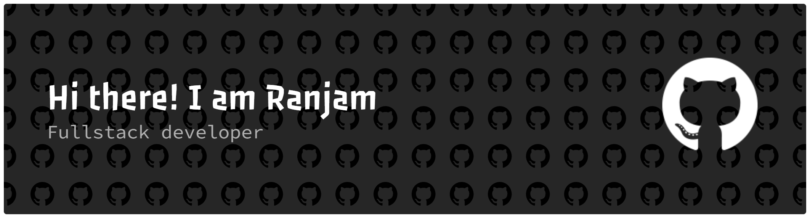
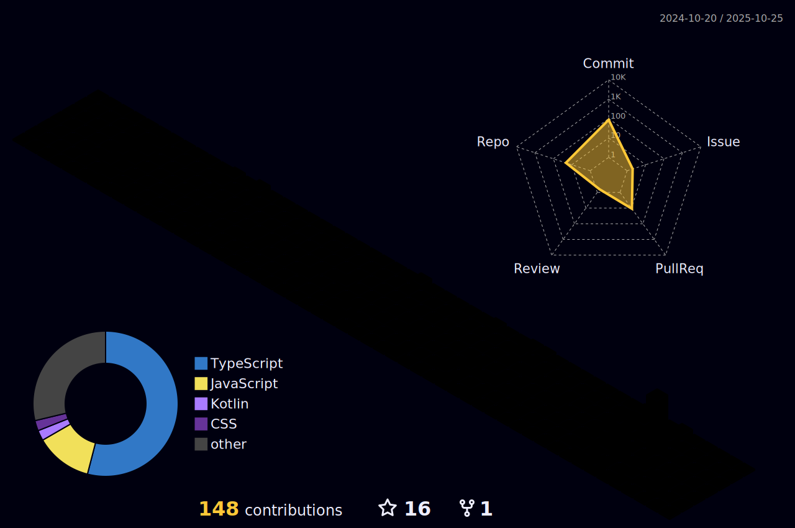

 

 

##  Short Intro

 

 

##   Languages, Frameworks & Tools

 

    
  

<!---
ryanzam/ryanzam is a ✨ special ✨ repository because its `README.md` (this file) appears on your GitHub profile.
You can click the Preview link to take a look at your changes.
--->
 

##  Stats

 

  
  
  

